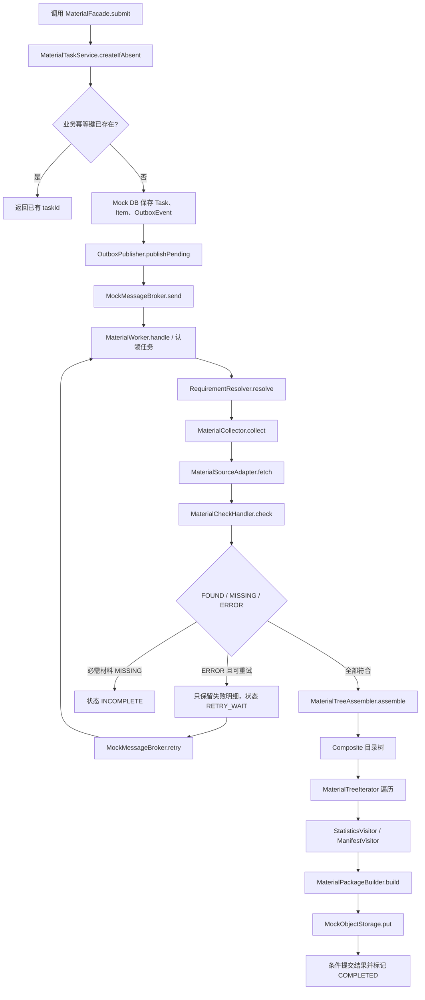
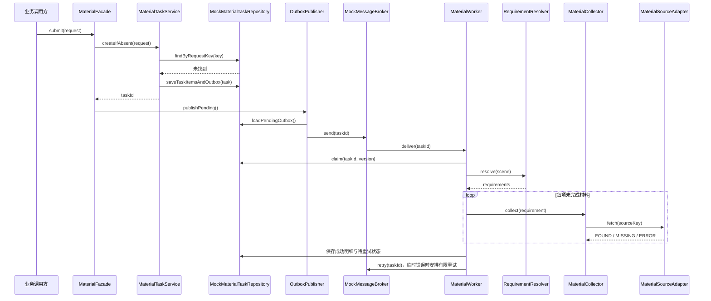

# 最终架构流程图与时序图

## 业务流程（方法名对应源码）

```mermaid
flowchart TD
    A[调用 MaterialFacade.submit] --> B[MaterialTaskService.createIfAbsent]
    B --> C{业务幂等键已存在?}
    C -- 是 --> Z[返回已有 taskId]
    C -- 否 --> D[Mock DB 保存 Task、Item、OutboxEvent]
    D --> E[OutboxPublisher.publishPending]
    E --> F[MockMessageBroker.send]
    F --> G[MaterialWorker.handle / 认领任务]
    G --> H[RequirementResolver.resolve]
    H --> I[MaterialCollector.collect]
    I --> J[MaterialSourceAdapter.fetch]
    J --> K[MaterialCheckHandler.check]
    K --> L{FOUND / MISSING / ERROR}
    L -- ERROR 且可重试 --> M[只保留失败明细，状态 RETRY_WAIT]
    M --> M2[MockMessageBroker.retry]
    M2 --> G
    L -- 必需材料 MISSING --> N[状态 INCOMPLETE]
    L -- 全部符合 --> O[MaterialTreeAssembler.assemble]
    O --> P[Composite 目录树]
    P --> Q[MaterialTreeIterator 遍历]
    Q --> R[StatisticsVisitor / ManifestVisitor]
    R --> S[MaterialPackageBuilder.build]
    S --> T[MockObjectStorage.put]
    T --> U[条件提交结果并标记 COMPLETED]
```

## 时序图（`MaterialFacade.submit` 到首次重试）

```mermaid
sequenceDiagram
    participant Client as 业务调用方
    participant Facade as MaterialFacade
    participant Service as MaterialTaskService
    participant Repo as MockMaterialTaskRepository
    participant Outbox as OutboxPublisher
    participant MQ as MockMessageBroker
    participant Worker as MaterialWorker
    participant Resolver as RequirementResolver
    participant Collector as MaterialCollector
    participant Adapter as MaterialSourceAdapter

    Client->>Facade: submit(request)
    Facade->>Service: createIfAbsent(request)
    Service->>Repo: findByRequestKey(key)
    Repo-->>Service: 未找到
    Service->>Repo: saveTaskItemsAndOutbox(task)
    Service-->>Facade: taskId
    Facade->>Outbox: publishPending()
    Outbox->>Repo: loadPendingOutbox()
    Outbox->>MQ: send(taskId)
    MQ->>Worker: deliver(taskId)
    Worker->>Repo: claim(taskId, version)
    Worker->>Resolver: resolve(scene)
    Resolver-->>Worker: requirements
    loop 每项未完成材料
        Worker->>Collector: collect(requirement)
        Collector->>Adapter: fetch(sourceKey)
        Adapter-->>Collector: FOUND / MISSING / ERROR
    end
    Worker->>Repo: 保存成功明细与待重试状态
    Worker->>MQ: retry(taskId)，临时错误时安排有限重试
```

重试时仅重新读取 `PENDING/RETRY_WAIT` 明细；成功明细保留。真实实现的并发认领需要数据库条件更新、租约与 fencing token，本图中的内存模拟不具备这些分布式保证。
