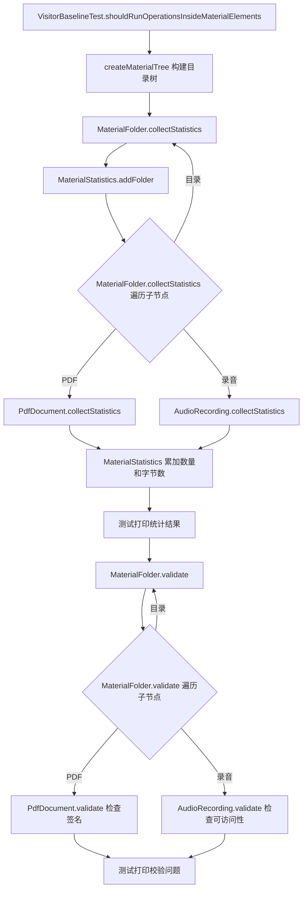
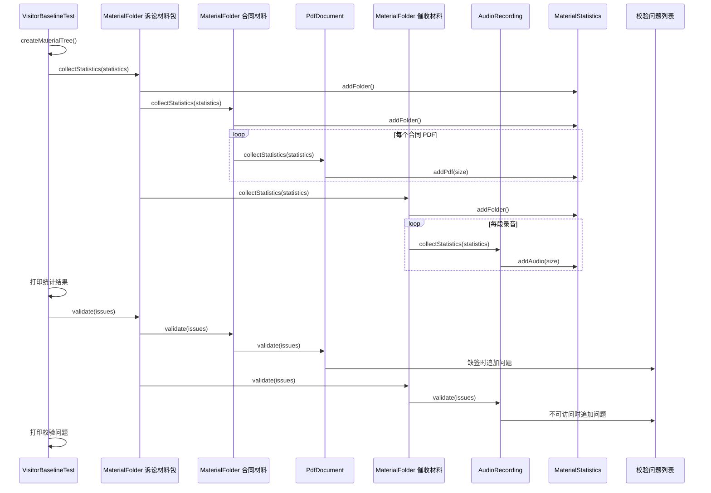

# v1-naive：节点直接实现操作

## 代码流程图

```mermaid
flowchart TD
    A[VisitorBaselineTest.shouldRunOperationsInsideMaterialElements] --> B[createMaterialTree 构建目录树]
    B --> C[MaterialFolder.collectStatistics]
    C --> D[MaterialStatistics.addFolder]
    D --> E{MaterialFolder.collectStatistics 遍历子节点}
    E -->|目录| C
    E -->|PDF| F[PdfDocument.collectStatistics]
    E -->|录音| G[AudioRecording.collectStatistics]
    F --> H[MaterialStatistics 累加数量和字节数]
    G --> H
    H --> I[测试打印统计结果]
    I --> J[MaterialFolder.validate]
    J --> K{MaterialFolder.validate 遍历子节点}
    K -->|目录| J
    K -->|PDF| L[PdfDocument.validate 检查签名]
    K -->|录音| M[AudioRecording.validate 检查可访问性]
    L --> N[测试打印校验问题]
    M --> N
```

## 代码时序图

```mermaid
sequenceDiagram
    participant Test as VisitorBaselineTest
    participant Root as MaterialFolder 诉讼材料包
    participant Contracts as MaterialFolder 合同材料
    participant Pdf as PdfDocument
    participant Recordings as MaterialFolder 催收材料
    participant Audio as AudioRecording
    participant Stats as MaterialStatistics
    participant Issues as 校验问题列表
    Test->>Test: createMaterialTree()
    Test->>Root: collectStatistics(statistics)
    Root->>Stats: addFolder()
    Root->>Contracts: collectStatistics(statistics)
    Contracts->>Stats: addFolder()
    loop 每个合同 PDF
        Contracts->>Pdf: collectStatistics(statistics)
        Pdf->>Stats: addPdf(size)
    end
    Root->>Recordings: collectStatistics(statistics)
    Recordings->>Stats: addFolder()
    loop 每段录音
        Recordings->>Audio: collectStatistics(statistics)
        Audio->>Stats: addAudio(size)
    end
    Test->>Test: 打印统计结果
    Test->>Root: validate(issues)
    Root->>Contracts: validate(issues)
    Contracts->>Pdf: validate(issues)
    Pdf->>Issues: 缺签时追加问题
    Root->>Recordings: validate(issues)
    Recordings->>Audio: validate(issues)
    Audio->>Issues: 不可访问时追加问题
    Test->>Test: 打印校验问题
```

## 阅读提示

- `MaterialNode` 同时定义 `collectStatistics` 和 `validate`，新增操作会扩展所有元素。
- 目录递归与业务操作一起留在元素类中；本版本作为 Visitor 出现前的基线。
